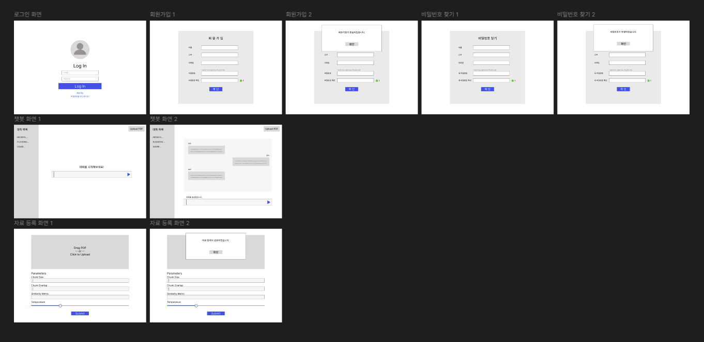

### 1. 사용자 흐름도 / 와이어 프레임 공유

- 각 페이지 별로 사용자의 흐름에 맞춰 시나리오를 작성하였음
- 작성된 시나리오를 토대로 와이어 프레임을 구성하였음

### 2. 학습 조직 신청서 작성

- 창립 취지
    1. 사내 AI 기술 역량 강화를 통해 AI 기술 인력을 확보
    2. Vendor 사와의 협업 시 AI 개발 Lifecycle에 대한 이해와 원활한 커뮤니케이션 기대
- 주요 활동 계획
    1. 사내 교육 및 외부 교육을 활용한 AI 기술 스택 함양
    2. AI 자격증 AICE 취득
    3. 문서 데이터베이스 챗봇 Demo 구현
- 성과 평가 목표
    1. 최종 Demo 결과물에 대해서 작성된 기능 명세서에 나열되어 있는 기능 중 실제 구현된 비율
        - S: 110%, A: 100%, B: 90%, C: 80%, D: 80% 이하
    2. AI 자격증인 AICE 취득을 목표로 총 학습 조직 인원 중 취득 인원 수로 목표 달성 확인
        - S: 5명 이상, A: 4명, B: 3명, C: 2명, D: 1명 이하

### 3. 다음 목표

- Todo List 작성 및 일정 계획
- 작성된 사용자 흐름 시나리오를 구조화하여 기능 명세서를 작성 >> [작성완료](https://github.com/sonly444/ai_tft/tree/main/DOC/AI_TFT_기능명세서서.pdf)
- 학습 조직 신청
- ppt 파일에 대한 모델 학습이 가능한지 확인
- 어떤 모델을 사용할 것인지 구체적인 계획 필요
- 다음 모임부터는 자격증 공부 얼마나 했는지 공유
- 학습 조직 신청 결과가 나오면 그때 모임 하는 것으로